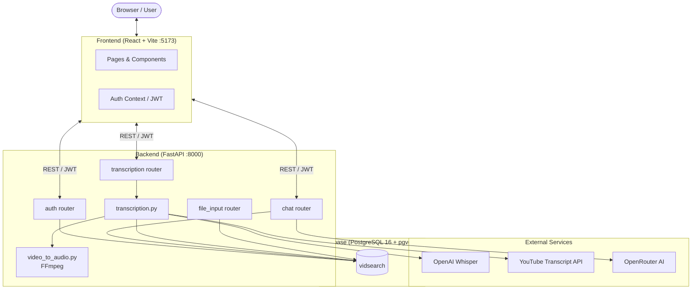
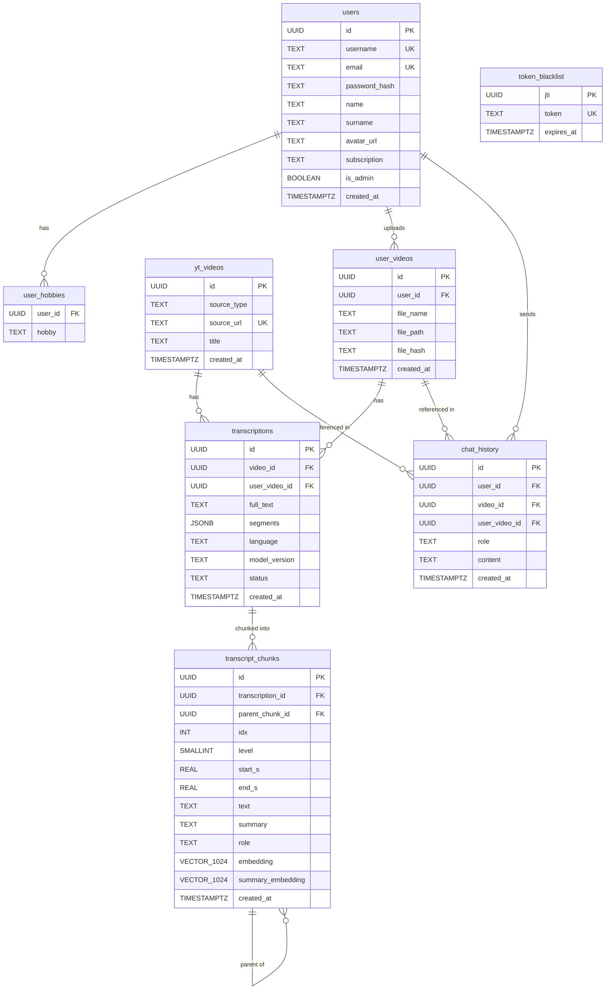
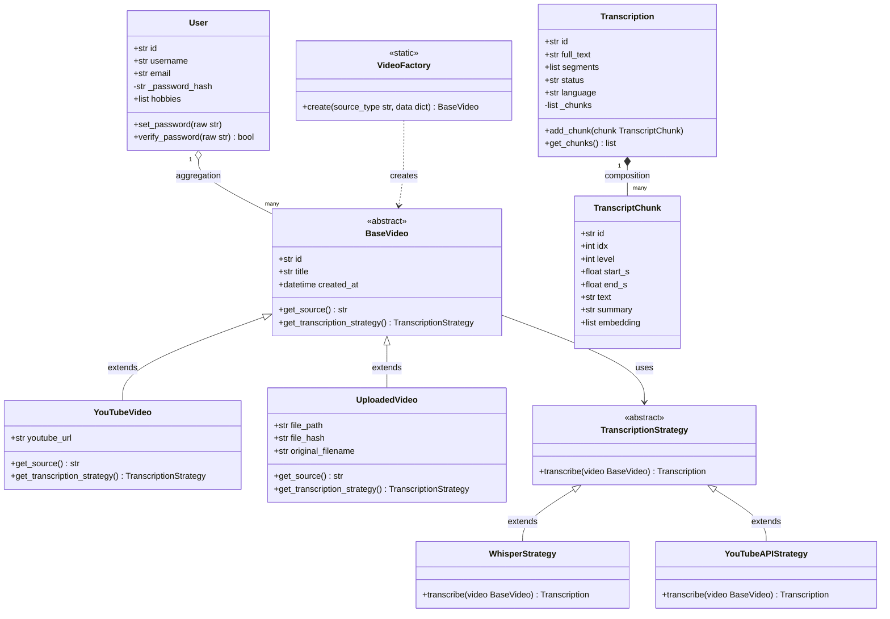
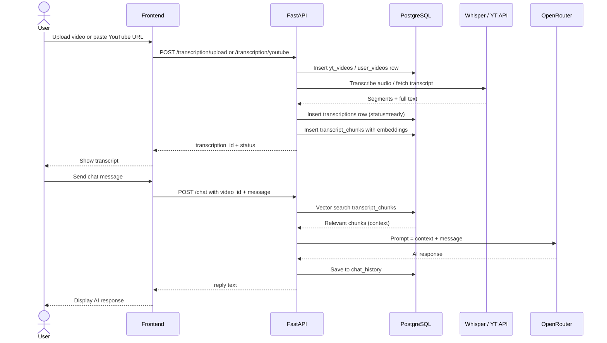

---

## Architecture & Diagrams

### System Architecture

```mermaid
flowchart TD
    User([Browser / User])

    subgraph Frontend["Frontend (React + Vite :5173)"]
        UI[Pages & Components]
        AuthCtx[Auth Context / JWT]
    end

    subgraph Backend["Backend (FastAPI :8000)"]
        Auth[auth router]
        Trans[transcription router]
        ChatR[chat router]
        FileR[file_input router]
        TCore[transcription.py]
        V2A[video_to_audio.py\nFFmpeg]
    end

    subgraph External["External Services"]
        Whisper[OpenAI Whisper]
        YTAPI[YouTube Transcript API]
        OpenRouter[OpenRouter AI]
    end

    subgraph DB["Database (PostgreSQL 16 + pgvector)"]
        PG[(vidsearch)]
    end

    User <--> Frontend
    Frontend <-->|REST / JWT| Auth
    Frontend <-->|REST / JWT| Trans
    Frontend <-->|REST / JWT| ChatR
    Auth --> PG
    Trans --> TCore
    ChatR --> OpenRouter
    ChatR --> PG
    TCore --> Whisper
    TCore --> YTAPI
    TCore --> V2A
    TCore --> PG
    FileR --> PG
```

---

### Database ER Diagram

```mermaid
erDiagram
    users {
        UUID id PK
        TEXT username UK
        TEXT email UK
        TEXT password_hash
        TEXT name
        TEXT surname
        TEXT avatar_url
        TEXT subscription
        BOOLEAN is_admin
        TIMESTAMPTZ created_at
    }
    user_hobbies {
        UUID user_id FK
        TEXT hobby
    }
    yt_videos {
        UUID id PK
        TEXT source_type
        TEXT source_url UK
        TEXT title
        TIMESTAMPTZ created_at
    }
    user_videos {
        UUID id PK
        UUID user_id FK
        TEXT file_name
        TEXT file_path
        TEXT file_hash
        TIMESTAMPTZ created_at
    }
    transcriptions {
        UUID id PK
        UUID video_id FK
        UUID user_video_id FK
        TEXT full_text
        JSONB segments
        TEXT language
        TEXT model_version
        TEXT status
        TIMESTAMPTZ created_at
    }
    transcript_chunks {
        UUID id PK
        UUID transcription_id FK
        UUID parent_chunk_id FK
        INT idx
        SMALLINT level
        REAL start_s
        REAL end_s
        TEXT text
        TEXT summary
        TEXT role
        VECTOR_1024 embedding
        VECTOR_1024 summary_embedding
        TIMESTAMPTZ created_at
    }
    token_blacklist {
        UUID jti PK
        TEXT token UK
        TIMESTAMPTZ expires_at
    }
    chat_history {
        UUID id PK
        UUID user_id FK
        UUID video_id FK
        UUID user_video_id FK
        TEXT role
        TEXT content
        TIMESTAMPTZ created_at
    }

    users ||--o{ user_hobbies : "has"
    users ||--o{ user_videos : "uploads"
    users ||--o{ chat_history : "sends"
    yt_videos ||--o{ transcriptions : "has"
    user_videos ||--o{ transcriptions : "has"
    transcriptions ||--o{ transcript_chunks : "chunked into"
    transcript_chunks ||--o{ transcript_chunks : "parent of"
    yt_videos ||--o{ chat_history : "referenced in"
    user_videos ||--o{ chat_history : "referenced in"
```

---

### OOP Class Diagram

```mermaid
classDiagram
    class BaseVideo {
        <<abstract>>
        +str id
        +str title
        +datetime created_at
        +get_source() str
        +get_transcription_strategy() TranscriptionStrategy
    }

    class YouTubeVideo {
        +str youtube_url
        +get_source() str
        +get_transcription_strategy() TranscriptionStrategy
    }

    class UploadedVideo {
        +str file_path
        +str file_hash
        +str original_filename
        +get_source() str
        +get_transcription_strategy() TranscriptionStrategy
    }

    class TranscriptionStrategy {
        <<abstract>>
        +transcribe(video BaseVideo) Transcription
    }

    class WhisperStrategy {
        +transcribe(video BaseVideo) Transcription
    }

    class YouTubeAPIStrategy {
        +transcribe(video BaseVideo) Transcription
    }

    class Transcription {
        +str id
        +str full_text
        +list segments
        +str status
        +str language
        -list _chunks
        +add_chunk(chunk TranscriptChunk)
        +get_chunks() list
    }

    class TranscriptChunk {
        +str id
        +int idx
        +int level
        +float start_s
        +float end_s
        +str text
        +str summary
        +list embedding
    }

    class VideoFactory {
        <<static>>
        +create(source_type str, data dict) BaseVideo
    }

    class User {
        +str id
        +str username
        +str email
        -str _password_hash
        +list hobbies
        +set_password(raw str)
        +verify_password(raw str) bool
    }

    BaseVideo <|-- YouTubeVideo : extends
    BaseVideo <|-- UploadedVideo : extends
    TranscriptionStrategy <|-- WhisperStrategy : extends
    TranscriptionStrategy <|-- YouTubeAPIStrategy : extends
    BaseVideo --> TranscriptionStrategy : uses
    Transcription "1" *-- "many" TranscriptChunk : composition
    User "1" o-- "many" BaseVideo : aggregation
    VideoFactory ..> BaseVideo : creates
```

---

### Upload & Chat Sequence

```mermaid
sequenceDiagram
    actor U as User
    participant FE as Frontend
    participant BE as FastAPI
    participant DB as PostgreSQL
    participant EXT as Whisper / YT API
    participant OR as OpenRouter

    U->>FE: Upload video or paste YouTube URL
    FE->>BE: POST /transcription/upload or /transcription/youtube
    BE->>DB: Insert yt_videos / user_videos row
    BE->>EXT: Transcribe audio / fetch transcript
    EXT-->>BE: Segments + full text
    BE->>DB: Insert transcriptions row (status=ready)
    BE->>DB: Insert transcript_chunks with embeddings
    BE-->>FE: transcription_id + status
    FE-->>U: Show transcript

    U->>FE: Send chat message
    FE->>BE: POST /chat with video_id + message
    BE->>DB: Vector search transcript_chunks
    DB-->>BE: Relevant chunks (context)
    BE->>OR: Prompt = context + message
    OR-->>BE: AI response
    BE->>DB: Save to chat_history
    BE-->>FE: reply text
    FE-->>U: Display AI response
```
