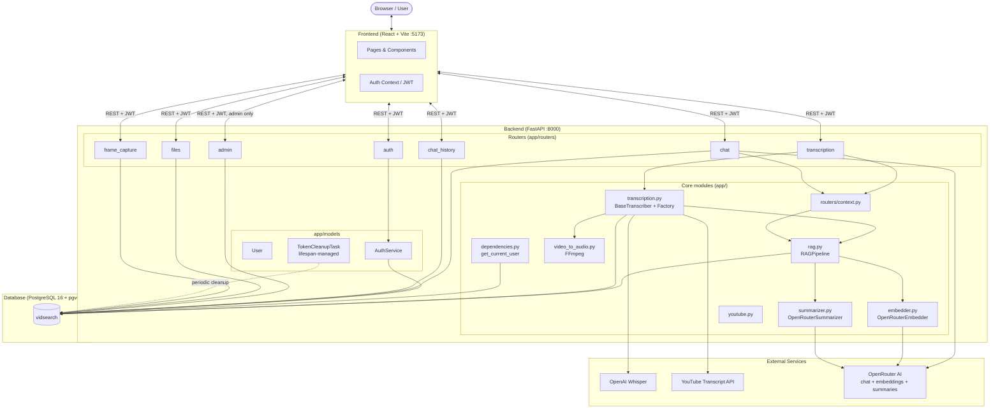
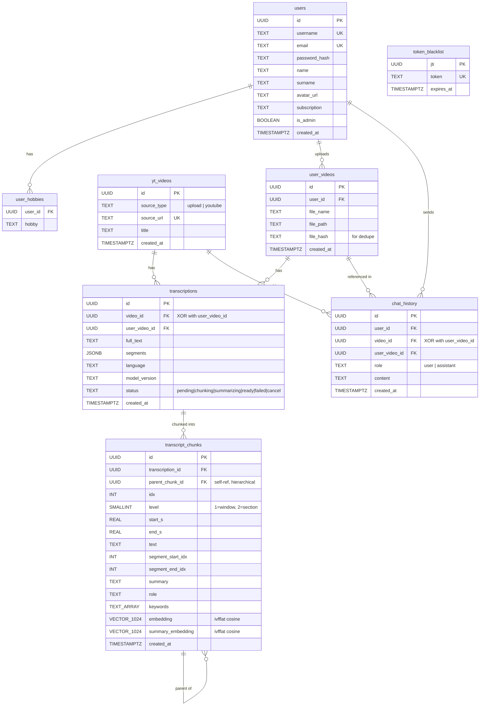
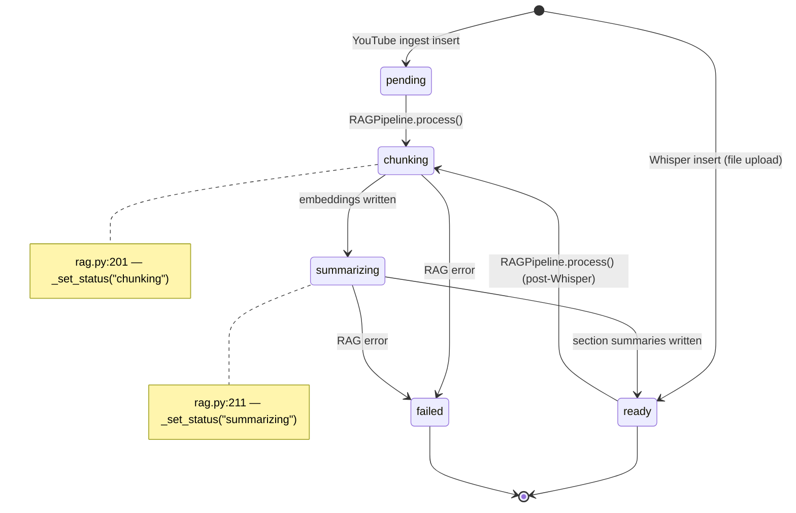
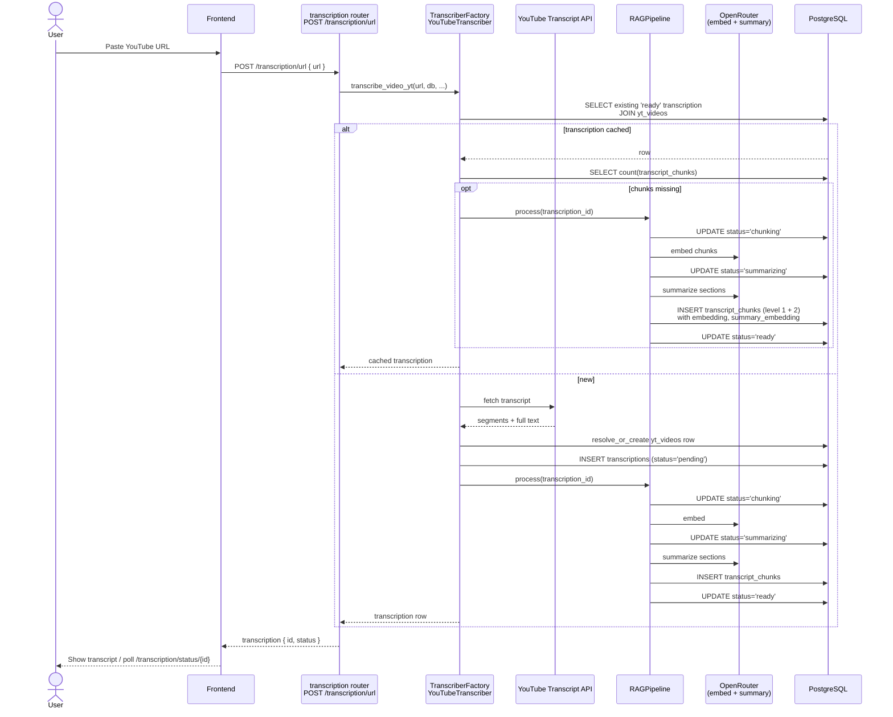
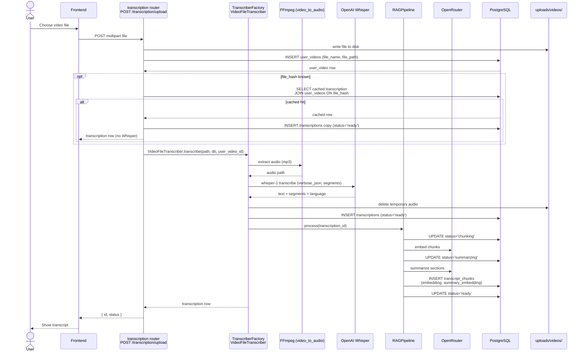
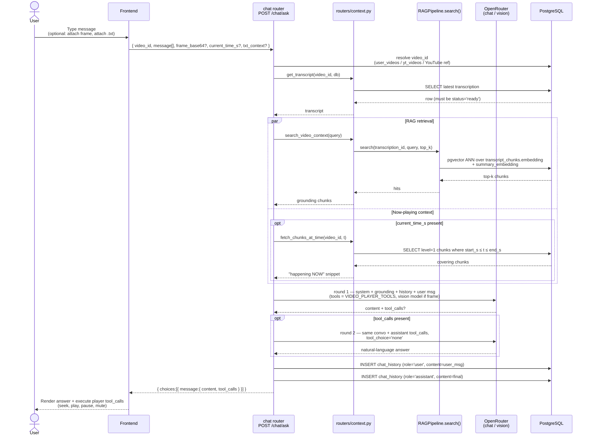

# VidSearch — DB & System Flow

Visual reference of how data moves through VidSearch: HTTP routers, the
PostgreSQL schema, the implemented OOP class hierarchy, the transcription
status machine, and the three end-to-end sequences (YouTube ingestion, file
upload, chat).

All diagrams are kept in sync with the current `backend/` source tree. When
adding a router, table, or class, update the matching diagram below.

---

## 1. System Architecture

Notes:
- `app/file_input.py` exists (defines `BaseFileUploader` / `VideoFileUploader`) but is **not** registered as a router — the actual upload router is `app/routers/files.py`.
- `OpenRouter` is consumed by three places: chat completions (`chat.py`), embeddings (`embedder.py`), and summaries (`summarizer.py`).
- `TokenCleanupTask` is started by the FastAPI `lifespan` handler in `main.py` and runs forever, deleting expired rows from `token_blacklist`.

---

## 2. Database ER Diagram

Vector indexes (defined in `schema.sql`):
- `transcript_chunks_embedding_idx` — `ivfflat (embedding vector_cosine_ops)`
- `transcript_chunks_summary_embedding_idx` — `ivfflat (summary_embedding vector_cosine_ops)`

XOR check on both `transcriptions` and `chat_history`: exactly one of `video_id` and `user_video_id` is non-null per row.

---

## 3. `transcriptions.status` State Machine

`cancel` is allowed by the CHECK constraint but is not currently driven by any
code path; it is reserved for future user-initiated cancellation.

---

## 4. OOP Class Diagram (as implemented)

```mermaid
classDiagram
    %% --- Transcription strategy (Factory + Strategy patterns) ---
    class BaseTranscriber {
        <<abstract>>
        +transcribe(source, db) dict*
    }
    class YouTubeTranscriber {
        -__get_video_id(url) str
        +transcribe(source, db, embed_model, summary_model) dict
    }
    class VideoFileTranscriber {
        -_call_whisper(audio_path)
        +transcribe(source, db, user_video_id) dict
    }
    class TranscriberFactory {
        <<factory>>
        +get_transcriber(source) BaseTranscriber
    }

    BaseTranscriber <|-- YouTubeTranscriber
    BaseTranscriber <|-- VideoFileTranscriber
    TranscriberFactory ..> BaseTranscriber : creates

    %% --- RAG pipeline (Composition + Strategy) ---
    class RAGPipeline {
        -db
        -embedder : Embedder
        -summarizer : Summarizer
        -section_summarizer : Summarizer
        -chunker : ChunkingStrategy
        +process(transcription_id)
        +search(transcription_id, query, top_k) list~RetrievedChunk~
    }
    class ChunkingStrategy {
        <<abstract>>
        +chunk(segments) list~Chunk~*
    }
    class FixedWindowChunker
    class Embedder {
        <<abstract>>
        +embed(texts) list*
    }
    class Summarizer {
        <<abstract>>
        +summarize(text) str*
    }
    class OpenRouterEmbedder
    class OpenRouterSummarizer
    class PlaceholderEmbedder
    class PlaceholderSummarizer

    ChunkingStrategy <|-- FixedWindowChunker
    Embedder        <|-- OpenRouterEmbedder
    Embedder        <|-- PlaceholderEmbedder
    Summarizer      <|-- OpenRouterSummarizer
    Summarizer      <|-- PlaceholderSummarizer
    RAGPipeline o-- ChunkingStrategy : composition
    RAGPipeline o-- Embedder         : composition
    RAGPipeline o-- Summarizer       : composition

    %% --- Audio extraction (Strategy) ---
    class BaseAudioExtractor {
        <<abstract>>
        +extract(video_path) str*
    }
    class FFmpegAudioExtractor
    BaseAudioExtractor <|-- FFmpegAudioExtractor

    %% --- File upload (Strategy) ---
    class BaseFileUploader {
        <<abstract>>
        +save(upload_file) Path*
    }
    class VideoFileUploader
    BaseFileUploader <|-- VideoFileUploader

    %% --- Auth (Composition) ---
    class PasswordHasher {
        +hash(raw) str
        +verify(raw, hashed) bool
    }
    class TokenManager {
        +issue(user_id) str
        +decode(token) dict
        +blacklist(token, db)
    }
    class BaseAuthService {
        <<abstract>>
        +register(...)*
        +login(...)*
    }
    class AuthService {
        -hasher : PasswordHasher
        -tokens : TokenManager
        +register(...)
        +login(...)
        +logout(...)
    }
    BaseAuthService <|-- AuthService
    AuthService o-- PasswordHasher : composition
    AuthService o-- TokenManager   : composition

    %% --- Background tasks (Template Method) ---
    class BackgroundTask {
        <<abstract>>
        +run_forever()
        +tick()*
    }
    class TokenCleanupTask {
        +tick()
    }
    BackgroundTask <|-- TokenCleanupTask

    %% --- Database (Strategy) ---
    class BaseDatabase {
        <<abstract>>
        +connect()*
        +get_connection()*
    }
    class PostgresDatabase
    BaseDatabase <|-- PostgresDatabase

    %% --- Domain model (Encapsulation + Factory Method) ---
    class User {
        -_id, _username, _email, _name, _surname
        -_avatar_url, _subscription, _is_admin
        -_hobbies, _created_at
        +id, username, email, ... (read-only @property)
        +from_db_row(row) User$
        +to_dict() dict
        +__repr__() str
    }

    %% --- CSV / TXT IO (Strategy + Template Method) ---
    class BaseCSVExporter {
        <<abstract>>
        +export(db) str
        +rows(db)*
        +headers()*
    }
    class StatsExporter
    class TranscriptionsExporter
    class VideosExporter
    class TXTURLImporter {
        +import_urls(text) list~str~
    }
    BaseCSVExporter <|-- StatsExporter
    BaseCSVExporter <|-- TranscriptionsExporter
    BaseCSVExporter <|-- VideosExporter
```

OOP pillars / patterns demonstrated (matches the coursework rubric in
`CLAUDE.md`):

| Pillar / Pattern  | Where in code |
|-------------------|---------------|
| Encapsulation     | `User` — every attribute is `_private` with a read-only `@property` (`models/user.py`) |
| Abstraction       | All `<<abstract>>` ABCs above (`BaseTranscriber`, `Embedder`, `Summarizer`, `ChunkingStrategy`, `BaseAudioExtractor`, `BaseFileUploader`, `BaseAuthService`, `BackgroundTask`, `BaseDatabase`, `BaseCSVExporter`) |
| Inheritance       | Each concrete class extending one of the ABCs above |
| Polymorphism      | `TranscriberFactory.get_transcriber(...).transcribe(...)`; `RAGPipeline` calling `Embedder.embed()` regardless of concrete type; admin route iterating `BaseCSVExporter` subclasses |
| Factory Method    | `User.from_db_row()` (`models/user.py`); `TranscriberFactory.get_transcriber()` (`transcription.py`) |
| Strategy          | `ChunkingStrategy`/`FixedWindowChunker` inside `RAGPipeline`; `BaseTranscriber` subclasses chosen by `TranscriberFactory` |
| Template Method   | `BackgroundTask.run_forever()` calling abstract `tick()`; `BaseCSVExporter.export()` calling abstract `rows()` / `headers()` |
| Composition       | `RAGPipeline` *has-a* `Embedder` + `Summarizer` + `ChunkingStrategy`; `AuthService` *has-a* `PasswordHasher` + `TokenManager` |
| Aggregation       | `User` *has-a* `hobbies` list (loaded from `user_hobbies`) |
| File I/O          | `TXTURLImporter` (TXT in) + `BaseCSVExporter` family (CSV out) in `routers/admin.py` |

---

## 5. Sequence A — YouTube URL Submission

---

## 6. Sequence B — File Upload

---

## 7. Sequence C — Chat (`POST /chat/ask`)

Tool calls are the structured side-channel the chat uses to drive the React
video player (`seek_video`, `play_video`, `pause_video`, etc.) — defined in
`app/routers/video_player_tools.py`.

---

## 8. Cross-references

| Diagram | Source of truth |
|---|---|
| System Architecture | `backend/main.py` (router includes + lifespan) |
| ER + indexes        | `backend/schema.sql` |
| Status state machine| `backend/app/rag.py:201,211,260,270` |
| OOP class diagram   | `grep -rn "^class " backend/app` |
| Sequence A          | `backend/app/transcription.py` (`YouTubeTranscriber`) + `backend/app/rag.py` |
| Sequence B          | `backend/app/transcription.py` (`VideoFileTranscriber`) + `backend/app/routers/transcription.py` |
| Sequence C          | `backend/app/routers/chat.py` + `backend/app/routers/context.py` |

To re-verify after refactors: every router box should match an
`app.include_router(...)` line in `main.py`; every column in the ER diagram
should appear in `schema.sql`; every class in the class diagram should be
findable with `grep -rn "^class <Name>" backend/app`.
